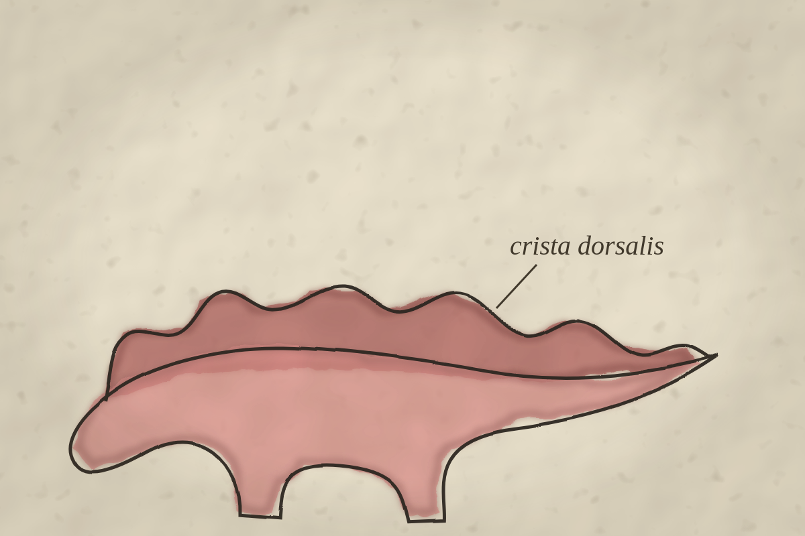
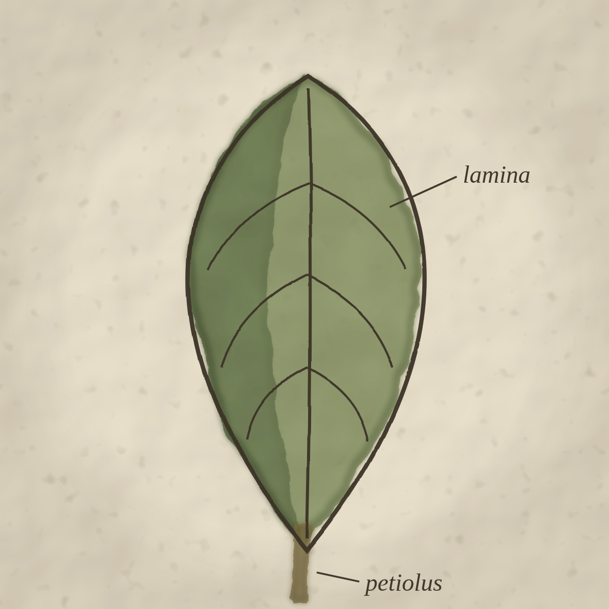
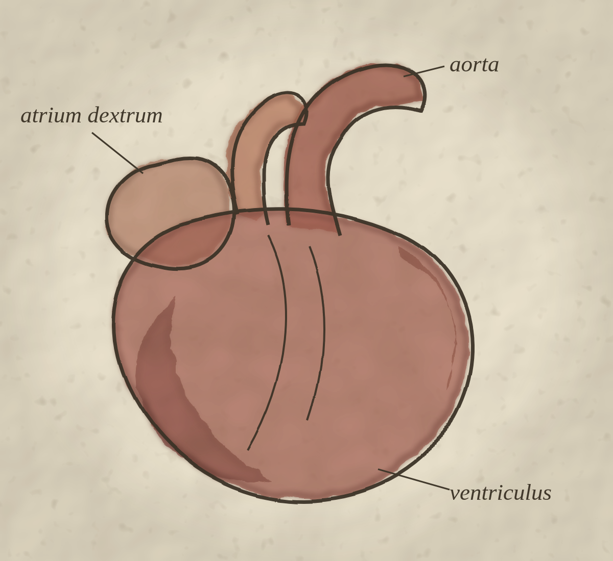

# aquarel

**Watercolor rendering for interactive SVGs, in the style of old biology
textbook plates.** *Aquarel* is Dutch for watercolor.



Aquarel takes clean, flat-colored SVG illustrations and renders them as
vintage watercolor plates — soft layered washes, pigment pooling along the
edges, granulation, slightly misregistered ink linework, aged paper — while
the result stays a **real, interactive SVG**: parts remain hoverable and
clickable, labels stay selectable text, and everything scales.

| | |
|:---:|:---:|
|  |  |

## How it works

The washes are a hybrid of build-time geometry and runtime SVG filters:

- Every wash region becomes a few translucent layers, generated by a
  [Tyler Hobbs–inspired](https://www.tylerxhobbs.com/words/a-guide-to-simulating-watercolor-paint-with-generative-art)
  recursive polygon deformation and smoothed into Catmull-Rom splines.
- An SVG filter chain adds the pigment character: a light edge melt
  (`feTurbulence` + `feDisplacementMap`), a darkened rim where pigment pools
  (`feMorphology` erosion), granulation, and an aged-paper ground with
  vignette (`feTurbulence` + `feDiffuseLighting`).
- The ink linework gets a hand wobble and a 1–2 unit misregistration offset,
  like a vintage lithograph print.
- Interactivity is decoupled from the paint: the original crisp paths sit
  on top as invisible hit targets, so hover/click/focus behave exactly as
  they would on the source SVG.

## Demos

```sh
npm install
npm run dev
```

Three comparison demos render the same source SVGs through different
approaches: [/a.html](a.html) pure runtime filters, [/b.html](b.html) pure
build-time geometry, and [/c.html](c.html) the chosen hybrid (hover the
figure parts).

## Status

Early days: the approach comparison (Phase 1) is complete and the hybrid
approach chosen. See [PLAN.md](PLAN.md) for the research notes, tuned
parameters, and roadmap toward a build pipeline + framework-agnostic
runtime helper.

## License

[MIT](LICENSE)
